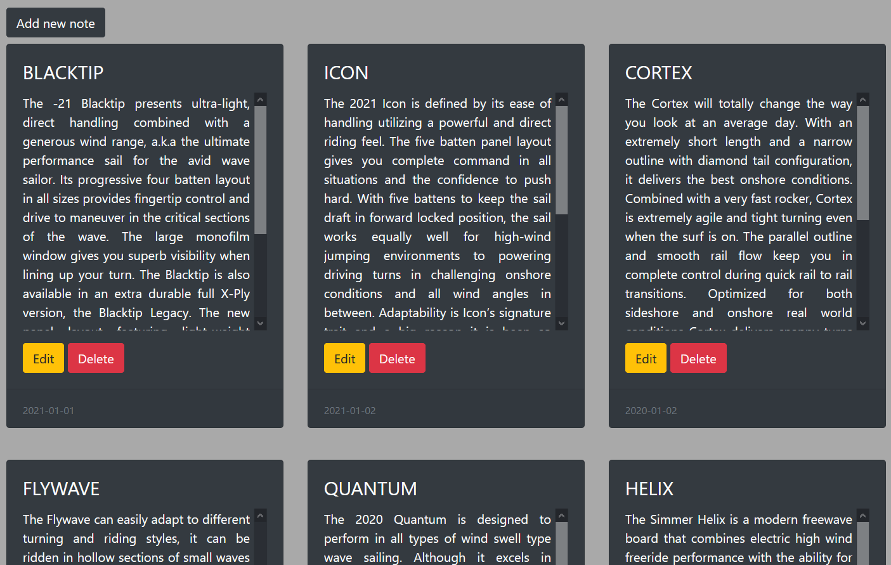
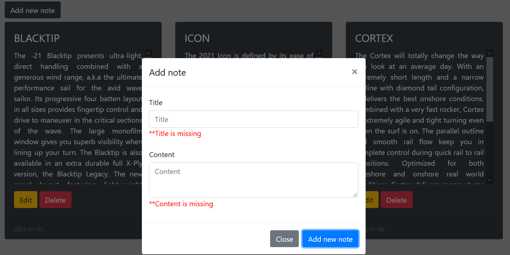
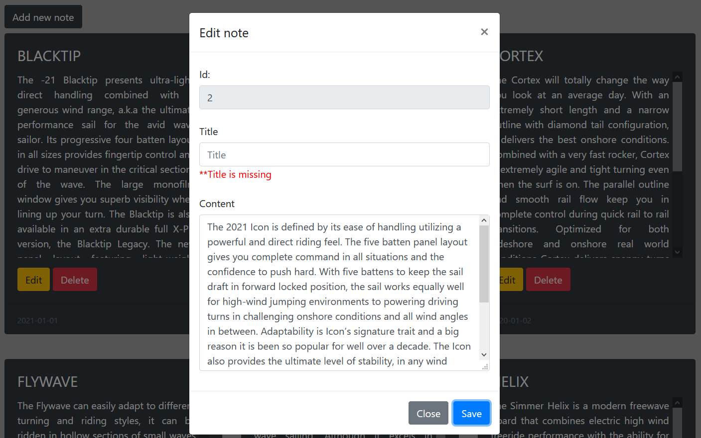

# AS_Notes 
[*Spring boot 2 academy*](https://www.akademiaspring.pl/)

## General
Application to add, show and edit notes. Data is storage in MySQL Database. Date of notes (footer) is updated 
automatically after adding or editing operation.

## Endpoints
    http://localhost:8080/notes-home
    http://localhost:8080/get-note-by-id
    http://localhost:8080/add-note
    http://localhost:8080/edit-note
    http://localhost:8080/delete-note

## Configuration

application.properties file:

    spring.datasource.url=
    spring.datasource.username=
    spring.datasource.password=
    spring.datasource.driver-class-name=
    spring.jpa.hibernate.ddl-auto=update

## Technologies
- Java 11
- Maven
- Spring Boot 2.4.0
- Thymeleaf
- Bootstrap(CSS)
- JQuery/JavaScript
- MySQL (remotesql.com)
- Hibernate

## Screenshots

